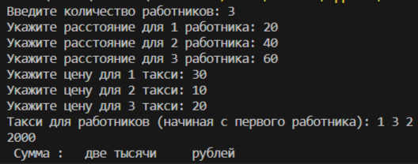
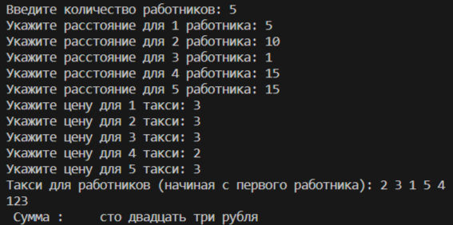

# Applied Coding 8
## Исполнитель    
Фадеев Алексей    
группа ФТ-220007    
## Лабораторная работа №8 - Сортировка    
Написать на любом языке программу: Такси.    
Директор фирмы решил заказать такси, чтобы развезти сотрудников по домам. Он заказал N машин — ровно столько, сколь у него сотрудников. У каждого водителя такси свой тариф за 1 километр. Директор знает, какому сотруднику сколько километров от работы до дома. Директор хочет определить, какой из сотрудников на каком такси должен поехать домой, чтобы суммарные затраты на такси были минимальны.    
## Среда разработки    
Язык программирования: Python.    
Среда разработки: Visual Studio Code.    
## Инструкция по работе    
***Входные данные:***    
Натуральное число N (1 ≤ N ≤ 1000) — количество сотрудников компании.    
Далее N чисел, задающих расстояния в километрах (положительные целые числа) от работы до домов сотрудников компании (первое число — для 1-го сотрудника, второе — для 2-го и т.д.).    
Далее еще N чисел — тарифы в рублях (положительные целые числа) за проезд одного километра в такси (первое число — в 1-ой машине такси, второе — во 2-ой и т.д.).    
***Выходные данные:***    
Выводится N чисел. Первое число — номер такси, в которое должен сесть 1-ый сотрудник, второе число — номер такси, в которое должен сесть 2-ой и т.д., чтобы суммарные затраты на такси были минимальны. Если вариантов рассадки сотрудников, при которых затраты минимальны, несколько, выведите любой из них.    
Сумма в рублях, которую необходимо заплатить за просчитанный вариант (цифрами).    
Сумма словами в рублях с указанием валюты в правильном падеже.    
## Тесты    
Тест 1    
    
Тест 2    
    
